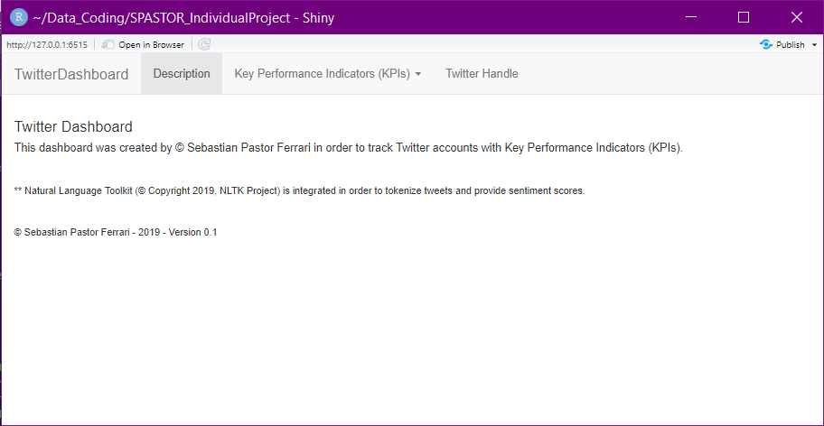

# R-Shiny - TwitterDashboard

#### Used to track and visualize relevant KPIs for select Twitter feeds. This project was submitted as my Final Project for the course: "Programming For Analytics" with Dr. Sivraj Kanungo at The George Washington University.

## sebastián pastor ferrari 2019 © - for reference only
###### "When Alexander saw the breadth of his domain... He wept, for there was no more world left to conquer."

### Main File: "app.r"

